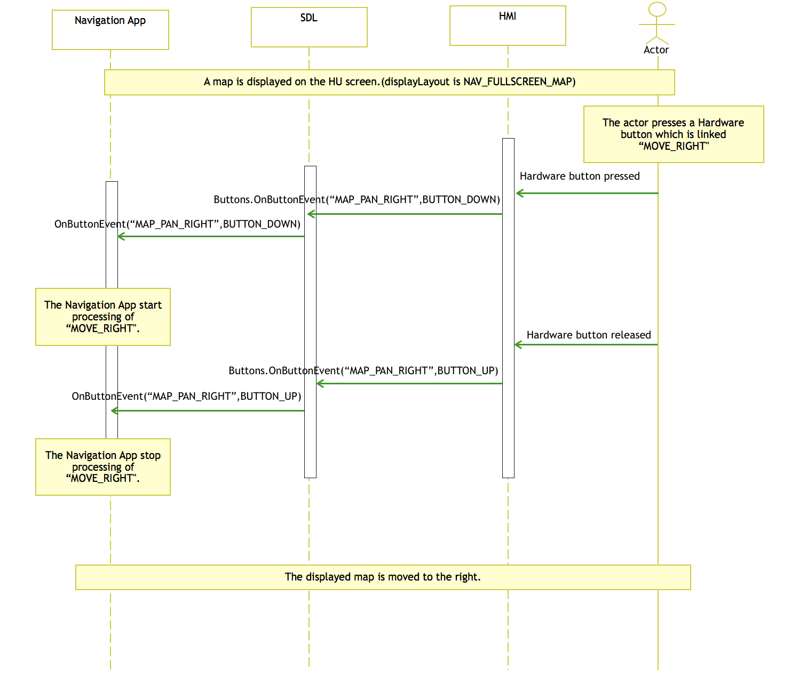
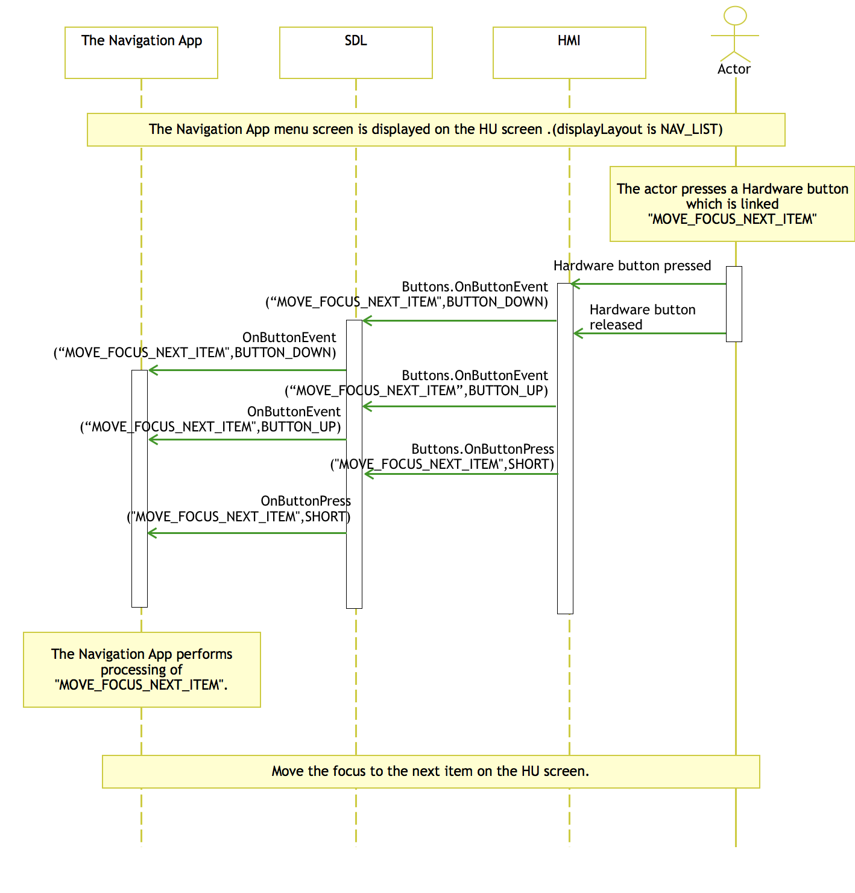

# Add ButtonName to use hardware buttons with shortcuts

* Proposal: [SDL-NNNN](NNNN-spec-add-ButtonName-to-use-hardware-buttons-with-shortcuts.md)
* Author: [XXXX]
* Status: **Awaiting review**
* Impacted Platforms: iOS, Android, Core, RPC

## Introduction

This proposal adds new set of functions (ButtonName) to enable the hardware button installed in the vehicle as a rotary button.

## Motivation

The aim of this proposal is to add the support for hardware button installed in the vehicle as a rotary button. Hardware buttons are physical input devices installed in vehicles such as rotary button. By linking a function (ButtonName) to a rotary button, the user can instruct the projection mode applications such as navigation application to Zoom In / Zoom Out, Back, etc. without using software buttons on the HU. Adding this function improves the operability and appearance of applications that use the projection mode.

## Proposed Solution

When an action is performed by the rotary button, the HU identifies the action and triggers the corresponding function to the application. For eg.

- **Rotary button Rotate Right:**
  HU understand this action and trigger the zoom-in function to Navigation app
- **Rotary button Rotate Left:**
   HU understand this action and trigger the zoom-out function to Navigation app
- **Rotary button Slide Upward:**
   HU understand this action and trigger the scroll-up function to Navigation app
- **Rotary button Slide Downward:**
   HU understand this action and trigger the scroll-down function to Navigation app
- **Rotary button Slide Leftward:**
   HU understand this action and trigger the scroll-left function to Navigation app
- **Rotary button Slide Rightward:**
   HU understand this action and trigger the scroll-right function to Navigation app

In this case the HU is responsible for handling the action from Rotary button and trigger the function to the mobile device.

The functions to be added is as follows,

- **Display Current Location:**
This is the function to recenter the current location in the screen. By adding this function, the users will be able to easily center their current location in the screen when using the Navigation App.

- **Zoom In:**
This function is for zooming in the map when using the Navigation App.

- **Zoom Out:**
This function is for zooming out the map when using the Navigation App.

- **Map Scroll Up:**
This is a function for scrolling up on the map when using the Navigation App.

- **Map Scroll Down:**
This function is for scrolling down on the map when using the Navigation App.

- **Map Scroll Left:**
This function is for scrolling to the left on the map when using the Navigation App.

- **Map Scroll Right:**
This function is for scrolling to the right on the map when using the Navigation App.

- **Move Focus Next Item:**
This function is for moving the focus to next item on the list screen of the navigation application.

- **Move Focus Previous Item:**
This function is for moving the focus to previous item on the list screen of the navigation application.

- **Go Back:**
It is a function for implement the back functionality.

- **Menu:**
This function is for displaying the consolidated list of menus in Navigation application. The application supplier need to display all the menu options in a single list when menu function is invoked.

- **Select:**
This function is for selecting the currently focused item of Navigation application.

#### Display Layout

In order to assign multiple functions to one hardware button, application need to notify the screen changes of projection application to HU as given below,

1. **NAV_FULLSCREEN_MAP :** Top layer screen of the Navigation app is Map Screen. If user press the back button from this screen, the application should exit.
2. **NAV_LIST：** Screen besides the Top layer of the Navigation app (List screen such as Menu).

Functions usage as per display layout is described in the table below,

|Display Layout | Function | Description |
|---|---|---|
|NAVI_FULLSCREEN|ZOOM-IN|Map Zoom-In|
|NAVI_FULLSCREEN|ZOOM-OUT|Map Zoom-Out|
|NAVI_FULLSCREEN|MAP_SCROLL_UP|Scrolling up on the map|
|NAVI_FULLSCREEN|MAP_SCROLL_DOWN|Scrolling down on the map|
|NAVI_FULLSCREEN|MAP_SCROLL_RIGHT|Scrolling right on the map|
|NAVI_FULLSCREEN|MAP_SCROLL_LEFT|Scrolling left on the map|
|NAVI_FULLSCREEN|DISPLAY_CURRENT_LOCATION|Recenter the current location in Map|
|NAVI_FULLSCREEN|MENU|Open menu of Navigation application|
|NAVI_LIST|MOVE_FOCUS_NEXT_ITEM|Moving the focus to next item on the list screen|
|NAVI_LIST|MOVE_FOCUS_PREVIOUS_ITEM|Moving the focus to previous item on the list screen|
|NAVI_LIST|SELECT|Selecting the currently focused item|
|Any Screen|GO_BACK|Go back to the previous screen|


The below sequences depicts the general idea of functions of  **"NAV_FULLSCREEN_MAP"** and **"NAV_LIST"** display layouts.

- The Navigation app start sequence (NAV_FULLSCREEN_MAP notice sequence)


- ButtonName notification sequence when "ZOOM_IN" is selected (NAV_FULLSCREEN_MAP)


- ButtonName notification sequence when "MENU" is selected (NAV_LIST)


- ButtonName notification sequence when "MAP_SCROLL_RIGHT" is selected (NAV_FULLSCREEN_MAP)



- ButtonName notification sequence when "MOVE_FOCUS_NEXT_ITEM" is selected (NAV_LIST)



## Detailed Design

#### SDL Core:

**hmi_capabilities_impl.cc**

```c
...
  button_enum_name.insert(
      std::make_pair(std::string("DISPLAY_CURRENT_LOCATION"), hmi_apis::Common_ButtonName::DISPLAY_CURRENT_LOCATION));
  button_enum_name.insert(
      std::make_pair(std::string("ZOOM_IN"), hmi_apis::Common_ButtonName::ZOOM_IN));
  button_enum_name.insert(
      std::make_pair(std::string("ZOOM_OUT"), hmi_apis::Common_ButtonName::ZOOM_OUT));
  button_enum_name.insert(
      std::make_pair(std::string("MAP_SCROLL_UP"), hmi_apis::Common_ButtonName::MAP_SCROLL_UP));
  button_enum_name.insert(
      std::make_pair(std::string("MAP_SCROLL_DOWN"), hmi_apis::Common_ButtonName::MAP_SCROLL_DOWN));
  button_enum_name.insert(
      std::make_pair(std::string("MAP_SCROLL_LEFT"), hmi_apis::Common_ButtonName::MAP_SCROLL_LEFT));
  button_enum_name.insert(
      std::make_pair(std::string("MAP_SCROLL_RIGHT"), hmi_apis::Common_ButtonName::MAP_SCROLL_RIGHT));
  button_enum_name.insert(
      std::make_pair(std::string("MOVE_FOCUS_NEXT_ITEM"), hmi_apis::Common_ButtonName::MOVE_FOCUS_NEXT_ITEM));
  button_enum_name.insert(
      std::make_pair(std::string("MOVE_FOCUS_PREVIOUS_ITEM"), hmi_apis::Common_ButtonName::MOVE_FOCUS_PREVIOUS_ITEM));
  button_enum_name.insert(
      std::make_pair(std::string("GO_BACK"), hmi_apis::Common_ButtonName::GO_BACK));
  button_enum_name.insert(
      std::make_pair(std::string("MENU"), hmi_apis::Common_ButtonName::MENU));
      button_enum_name.insert(
      std::make_pair(std::string("SELECT"), hmi_apis::Common_ButtonName::SELECT));
```

**HMI_API.xml**

```xml
...
<enum name="ButtonName">
    ...
    <!-- Buttons for mobile navigation apps -->
        <!--
         * These buttons are used to manipulate the mobile navigation application with hardware keys.
         * These buttons can be used when the mobile navigation application sets "NAV_FULLSCREEN_MAP" or "NAV_LIST" as displayLayout.
         -->
    <element name="DISPLAY_CURRENT_LOCATION">
        <warning>
            Notify "DISPLAY_CURRENT_LOCATION" function irrespective of the set displayLayout.
            When this function is notified, please display the current location in the center of the screen regardless of the display status.
        </warning>
    </element>
    <element name="ZOOM_IN">
        <warning>
            It may be notified when displayLayout is set to "NAV_FULLSCREEN_MAP".
        </warning>
    </element>
    <element name="ZOOM_OUT">
        <warning>
            It may be notified when displayLayout is set to "NAV_FULLSCREEN_MAP".
        </warning>
    </element>
    <element name="MAP_SCROLL_UP">
        <warning>
            It may be notified when displayLayout is set to "NAV_FULLSCREEN_MAP".
        </warning>
    </element>
    <element name="MAP_SCROLL_DOWN">
        <warning>
            It may be notified when displayLayout is set to "NAV_FULLSCREEN_MAP".
        </warning>
    </element>
    <element name="MAP_SCROLL_LEFT">
        <warning>
            It may be notified when displayLayout is set to "NAV_FULLSCREEN_MAP".
        </warning>
    </element>
    <element name="MAP_SCROLL_RIGHT">
        <warning>
            It may be notified when displayLayout is set to "NAV_FULLSCREEN_MAP".
        </warning>
    </element>
    <element name="MOVE_FOCUS_NEXT_ITEM">
        <warning>
            It may be notified when displayLayout is set to "NAV_LIST".
        </warning>
    </element>
    <element name="MOVE_FOCUS_PREVIOUS_ITEM">
        <warning>
            It may be notified when displayLayout is set to "NAV_LIST".
        </warning>
    </element>
    <element name="GO_BACK">
        <warning>
            It may be notified when displayLayout is set to "NAV_LIST".
        </warning>
    </element>
    <element name="MENU" />
        <warning>
            It may be notified when displayLayout is set to "NAV_FULLSCREEN_MAP".
            When this function is notified, it is necessary for the application to consider the function distribution.
            For example, when this function is notified during map scrolling, it is necessary to display the destination setting item of Menu.
        </warning>
    </element>
    <element name="SELECT">
        <warning>
            It may be notified when displayLayout is set to "NAV_LIST".
        </warning>
    </element>
</enum>
...
```

**MOBILE_API.xml**
```xml
...
<enum name="ButtonName">
    ...
        <!-- Buttons for mobile navigation apps -->
            <!--
            * These buttons are used to manipulate the mobile navigation application with hardware keys.
            * These buttons can be used when the mobile navigation application sets "NAV_FULLSCREEN_MAP" or "NAV_LIST" as displayLayout.
            -->
        <element name="DISPLAY_CURRENT_LOCATION" since="x.x">
            <warning>
                Notify "DISPLAY_CURRENT_LOCATION" function irrespective of the set displayLayout.
                When this function is notified, please display the current location in the center of the screen regardless of the display status.
            </warning>
        </element>
        <element name="ZOOM_IN" since="x.x">
            <warning>
                It may be notified when displayLayout is set to "NAV_FULLSCREEN_MAP".
            </warning>
        </element>
        <element name="ZOOM_OUT" since="x.x">
            <warning>
                It may be notified when displayLayout is set to "NAV_FULLSCREEN_MAP".
            </warning>
        </element>
        <element name="MAP_SCROLL_UP" since="x.x">
             <warning>
                It may be notified when displayLayout is set to "NAV_FULLSCREEN_MAP".
            </warning>
        </element>
        <element name="MAP_SCROLL_DOWN" since="x.x">
            <warning>
                It may be notified when displayLayout is set to "NAV_FULLSCREEN_MAP".
            </warning>
        </element>
        <element name="MAP_SCROLL_LEFT" since="x.x">
            <warning>
                It may be notified when displayLayout is set to "NAV_FULLSCREEN_MAP".
            </warning>
        </element>
        <element name="MAP_SCROLL_RIGHT" since="x.x">
            <warning>
                It may be notified when displayLayout is set to "NAV_FULLSCREEN_MAP".
            </warning>
        </element>
        <element name="MOVE_FOCUS_NEXT_ITEM" since="x.x">
            <warning>
                It may be notified when displayLayout is set to "NAV_LIST".
            </warning>
        </element>
        <element name="MOVE_FOCUS_PREVIOUS_ITEM" since="x.x">
            <warning>
                It may be notified when displayLayout is set to "NAV_LIST".
            </warning>
        </element>
        <element name="GO_BACK" since="x.x">
            <warning>
                It may be notified when displayLayout is set to "NAV_LIST".
            </warning>
        </element>
        <element name="MENU" since="x.x">
            <warning>
                It may be notified when displayLayout is set to "NAV_FULLSCREEN_MAP".
                When this function is notified, it is necessary for the application to consider the function distribution.
                For example, when this function is notified during map scrolling, it is necessary to display the destination setting item of Menu.
            </warning>
        </element>
        <element name="SELECT" since="x.x">
            <warning>
                It may be notified when displayLayout is set to "NAV_LIST".
            </warning>
        </element>
    </enum>
...

```

#### iOS:

**SDLButtonName.h:**

```objc
@import "SDLEnum.h"

...
/**
 * Represents a display current location button.
 */
extern SDLButtonName const SDLButtonNameDisplayCurrentLocation;

/**
 * Represents a zoom in button.
 */
extern SDLButtonName const SDLButtonNameZoomIn;

/**
 * Represents a zoom out button.
 */
extern SDLButtonName const SDLButtonNameZoomOut;

/**
 * Represents a map scroll up button.
 */
extern SDLButtonName const SDLButtonNameMapScrollUp;

/**
 * Represents a map scroll down button.
 */
extern SDLButtonName const SDLButtonNameMapScrollDown;

/**
 * Represents a map scroll left button.
 */
extern SDLButtonName const SDLButtonNameMapScrollLeft;

/**
 * Represents a map scroll right button.
 */
extern SDLButtonName const SDLButtonNameMapScrollRight;

/**
 * Represents a move focus next item button.
 */
extern SDLButtonName const SDLButtonNameMoveFocusNextItem;

/**
 * Represents a move focus previous item button.
 */
extern SDLButtonName const SDLButtonNameMoveFocusPreviousItem;

/**
 * Represents a back button.
 */
extern SDLButtonName const SDLButtonNameGoBack;

/**
 * Represents a menu button.
 */
extern SDLButtonName const SDLButtonNameMenu;

/**
 * Represents a menu button.
 */
extern SDLButtonName const SDLButtonNameSelect;

```

**SDLButtonName.m:**

```objc
...
SDLButtonName const SDLButtonNameDisplayCurrentLocation = @"DISPLAY_CURRENT_LOCATION";
SDLButtonName const SDLButtonNameZoomIn = @"ZOOM_IN";
SDLButtonName const SDLButtonNameZoomOut = @"ZOOM_OUT";
SDLButtonName const SDLButtonNameMapScrollUp = @"MAP_SCROLL_UP";
SDLButtonName const SDLButtonNameMapScrollDown = @"MAP_SCROLL_DOWN";
SDLButtonName const SDLButtonNameMapScrollLeft = @"MAP_SCROLL_LEFT";
SDLButtonName const SDLButtonNameMapScrollRight = @"MAP_SCROLL_RIGHT";
SDLButtonName const SDLButtonNameMoveFocusUp = @"MOVE_FOCUS_NEXT_ITEM";
SDLButtonName const SDLButtonNameMoveFocusDown = @"MOVE_FOCUS_PREVIOUS_ITEM";
SDLButtonName const SDLButtonNameGoBack = @"GO_BACK";
SDLButtonName const SDLButtonNameMenu = @"MENU";
SDLButtonName const SDLButtonNameSelect = @"SELECT";
```

#### Android:

**ButtonName.java**

```java
public enum ButtonName {
    ...,
    /**
     * Represents the display current location button.
     *
     * @since SmartDeviceLink x.x
     */
    DISPLAY_CURRENT_LOCATION,
    /**
     * Represents the zoom in button.
     *
     * @since SmartDeviceLink x.x
     */
    ZOOM_IN,
    /**
     * Represents the zoom out button.
     *
     * @since SmartDeviceLink x.x
     */
    ZOOM_OUT,
    /**
     * Represents the map scroll up button.
     *
     * @since SmartDeviceLink x.x
     */
    MAP_SCROLL_UP,
    /**
     * Represents the map scroll down button.
     *
     * @since SmartDeviceLink x.x
     */
    MAP_SCROLL_DOWN,
    /**
     * Represents the map scroll left button.
     *
     * @since SmartDeviceLink x.x
     */
    MAP_SCROLL_LEFT,
    /**
     * Represents the map scroll right button.
     *
     * @since SmartDeviceLink x.x
     */
    MAP_SCROLL_RIGHT,
    /**
     * Represents the move focus up button.
     *
     * @since SmartDeviceLink x.x
     */
    MOVE_FOCUS_NEXT_ITEM,
    /**
     * Represents the move focus next item button.
     *
     * @since SmartDeviceLink x.x
     */
    MOVE_FOCUS_PREVIOUS_ITEM,
    /**
     * Represents the move focus previous item button.
     *
     * @since SmartDeviceLink x.x
     */
    GO_BACK,
    /**
     * Represents the menu button.
     *
     * @since SmartDeviceLink x.x
     */
    MENU,
     /**
     * Represents the select button.
     *
     * @since SmartDeviceLink x.x
     */
    SELECT,
    ;
    ...
}
```

## Potential downsides

There are no downsides assumed for this proposal.

## Impact on existing code

This change will not affect previous versions of SDL.

## Alternatives considered

Instead of notifying the actions to be performed, HU notifies the hardware button action directly to the application. Then the application works by interpreting the action by itself. For example,

- **Rotary button Rotate Right**
   HU sends the action directly to Navigation app and Navigation app in projection mode understand this action and perform the function.
- **Rotary button Rotate Left**
   HU sends the action directly to Navigation app and Navigation app in projection mode understand this action and perform the function.
- **Rotary button Slide Upward**
   HU sends the action directly to Navigation app and Navigation app in projection mode understand this action and perform  the function.
- **Rotary button Slide Downward**
   HU sends the action directly to Navigation app and Navigation app in projection mode understand this action and perform the function.
- **Rotary button Slide Leftward**
   HU sends the action directly to Navigation app and Navigation app in projection mode understand this action and perform the function.
- **Rotary button Slide Rightward**
   HU sends the action directly to Navigation app and Navigation app in projection mode understand this action and perform the function.

**Potential downsides** of alternate proposal are,
1. It's hard to define all the hardware buttons which all the OEM have
2. The OEMs are not able to control the user experiences nor the unified UI behavior between other similar applications because only the application vendor knows how to deal the hardware button.
